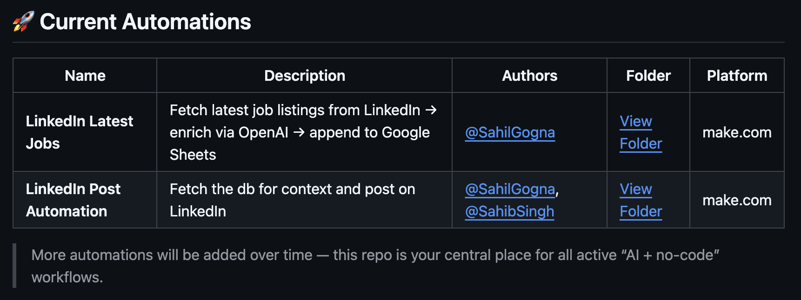

# Pull Request Instructions & Standards

Thanks for contributing to **ai-automations-no-code**!  
To keep this repository clean and consistent, please follow these standards when adding a new automation.

---

## 📂 Folder Structure
- Each automation must live inside its own folder under the repo root.  
- Use a **clear, kebab-case name** (e.g., `linkedin-latest-jobs`, `linkedin-post-automation`).  

**Example folder layout:**
```
automation-name/
  ├── images/
  │     ├── flow-diagram.png
  │     ├── module-x.png
  │     └── ...
  ├── instructions.md
  ├── automation-export.json
  └── readme.md   (optional, if extra context is needed)
```

---

## 🖼 Image Naming
- Place all screenshots and diagrams in an `images/` folder.  
- Use **kebab-case** filenames describing the content:
  - `rss-feed.png`
  - `http-module.png`
  - `final-flow.png`

---

## 📜 Instructions File
- Every automation must include an **`instructions.md`** file.  
- Use this format:
  - Overview of the automation  
  - Step-by-step setup instructions  
  - Your **name(s)** and a **public link to a demo video** (YouTube, Loom, etc.)  

👉 You can refer to this sample:  
[linkedin-latest-jobs/instructions.md](https://github.com/SahilGogna/ai-automations-no-code/blob/main/linkedin-latest-jobs/instructions.md)

---

## 📦 Automation Export
- Export your Make.com scenario and include it as a `.json` file in the root of your automation folder.  
- Name it clearly: `automation-name-make-automation.json`.

---

## 📑 Updating the Main Table

Finally, update the **Current Automations** table in the root `readme.md`.

- Add a new row for your automation with:
  - **Name** → Same as your folder name  
  - **Description** → 1–2 line explanation of what your automation does  
  - **Authors** → Your GitHub handle(s), e.g., `@username`  
  - **Folder** → A link to your automation folder (use `[View Folder](./folder-name)`)  
  - **Platform** → Tool/platform used (e.g., `make.com`, `zapier`, etc.)  



---

## ✅ Example
Your automation should follow the same standards as this reference:  
[linkedin-latest-jobs](https://github.com/SahilGogna/ai-automations-no-code/tree/main/linkedin-latest-jobs)
