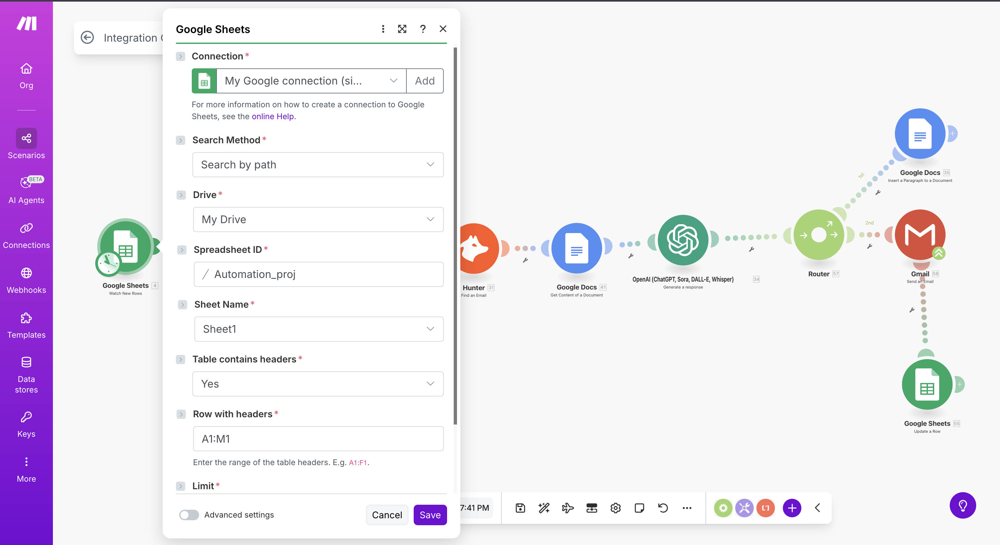
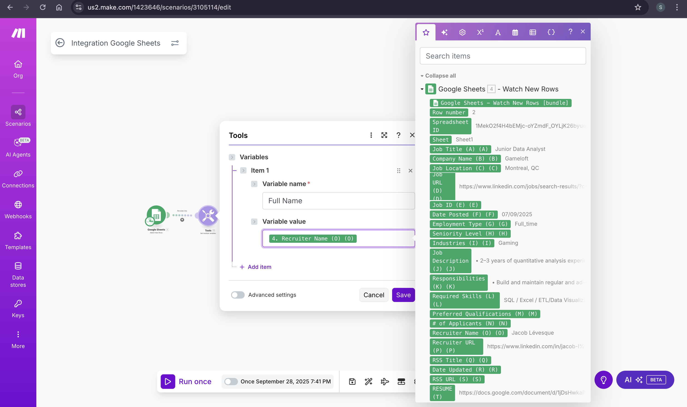
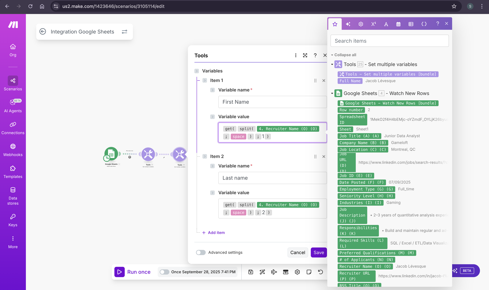
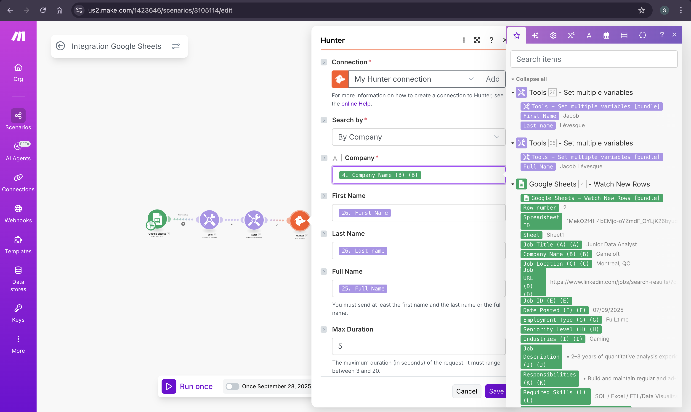
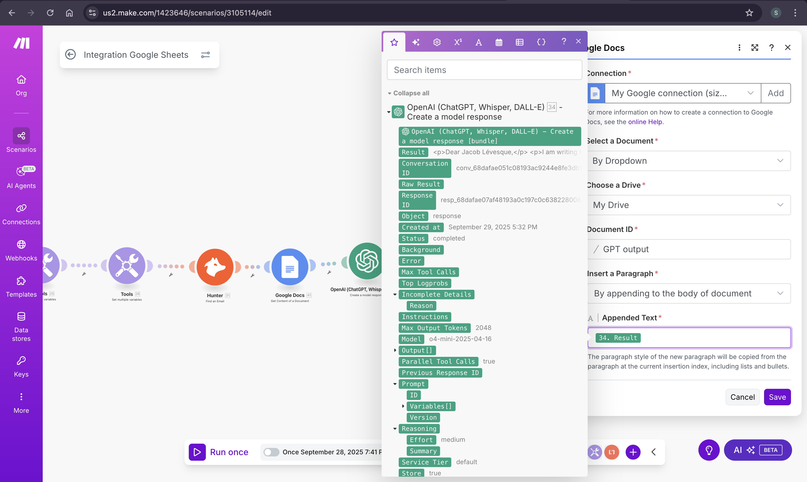
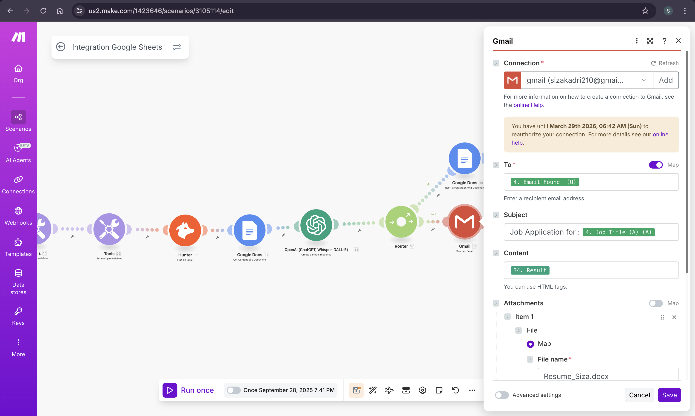
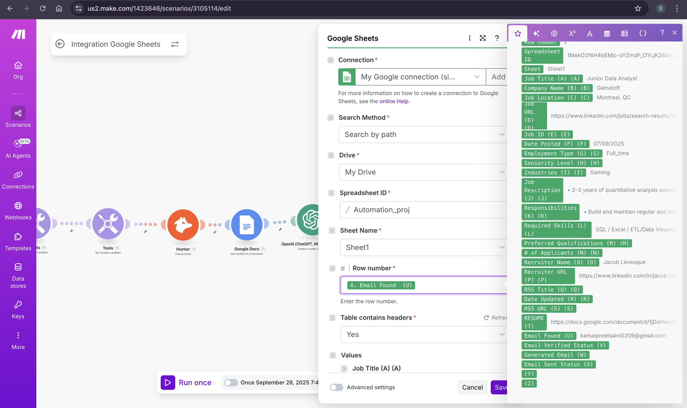

## Recruiter Outreach Automation Documentation
Automate your recruiter outreach process — from job listing detection to personalized email delivery — using Make.com and OpenAI.


This automation helps you automatically send personalized recruiter outreach emails using **Make.com**, **Hunter.io**, **OpenAI**, **Gmail**, **Google Docs**, and **Google Sheets**.  
It detects new recruiter email from job postings , generates a tailored outreach email, sends it automatically, and logs everything for tracking and documentation.

---

### 1. Workflow Overview

**What this automation does:**
- Watches for new recruiter/job entries in **Google Sheets**
- Extracts recruiter details and finds verified emails via **Hunter.io**
- Retrieves resume details from **Google Docs**
- Uses **OpenAI** to generate a personalized outreach email
- Sends the email automatically via **Gmail**
- Saves the email and updates status logs in **Google Docs** and **Google Sheets**

**Tools Used:**
- Make.com (Scenario builder)
- Google Sheets
- Google Docs
- Hunter.io
- OpenAI API
- Gmail

---

### 2. Step 1: Connect Google Sheets

Set up a **Google Sheets “Watch New Rows”** module as the scenario trigger.

1. Add the Google Sheets Module  
   - In your Make.com scenario, click the ➕ button to add a new module.  
   - Search for **Google Sheets → Watch New Rows**.

2. Connect Your Google Account  
   - Click **Add**, sign in with your Google account, and grant permissions.

3. Configure the Spreadsheet  
   - **Search Method:** Search by path  
   - **Drive:** My Drive  
   - **Spreadsheet ID:** Select your recruiter sheet  
   - **Sheet Name:** Select (e.g., Sheet1)  
   - **Table contains headers:** Yes

   
   5. Save your module. It will now automatically capture new job postings.

---

### 3. Step 2: Prepare Recruiter Variables

Extract the recruiter’s full name from Google Sheets so **Hunter.io** can use it to find emails.

1. Add **Tools → Set Multiple Variables**
2. Create a variable:  
   - **Variable name:** Full Name  
   - **Variable value:** Map the recruiter’s name column from Google Sheets

   
   3. Save the module.

---

### 4. Step 3: Split Recruiter Name into First and Last

Hunter.io requires both first and last names for accurate lookup.

1. Add another **Tools → Set Multiple Variables** module.  
2. Create these variables:

   **First Name:**  
   ```
   get(split(Recruiter Name; space); 1)
   ```

   **Last Name:**  
   ```
   get(split(Recruiter Name; space); 2)
   ```

   
   3. Save your changes.

---

### 5. Step 4: Find Recruiter Email via Hunter.io

Use **Hunter.io** to fetch recruiter emails.

1. **Create the Hunter connection (API key)**  
   - Log in to hunter.io → API → Copy your key  
   - In Make.com, add **Hunter → Find an Email**  
   - Click **Add Connection**, paste the key, and save

2. **Configure fields:**  
   - **Search by:** By Company  
   - **Company:** Map from Google Sheets  
   - **First Name:** Map from variable  
   - **Last Name:** Map from variable  
   - **Full Name:** (optional) map Full Name too

   
   3. **Run once** to test and verify that emails are returned.

---

### 6. Step 5: Get Resume Content from Google Docs

Pull your resume text from **Google Docs** for OpenAI to use.

1. Add **Google Docs → Get Content of a Document**
2. Connect your Google account
3. Choose your document:
   - **By Dropdown:** Pick your resume file  
   - **Or By URL/ID:** Paste the resume link

   
---

### 7. Step 6: Configure OpenAI Email Generation

#### 6.1 Get your API key
1. Sign in to OpenAI → [Platform → API Keys] → Create new key  
2. Copy it and keep it safe (don’t share it in code or screenshots)

#### 6.2 Create OpenAI connection in Make.com
- Add **OpenAI → Create a model response**
- Paste your API key and save

#### 6.3 Configure model settings
- **Model:** o4-mini (system)
- **Prompt type:** Text prompt
- **Prompt:** Use the template below and map fields from previous steps.


#### Prompt Template

```html
You are a professional career coach writing recruiter outreach emails. Your task is to draft a concise, professional cold email, no more than 250 words, to apply for the "{{Job Title}}" position.

The email must leverage the candidate's information from the resume [{{Resume Text}}] and the job requirements from {{Job Description}} to demonstrate a strong, targeted fit.

Key Requirements:
- Opening: Brief, compelling introduction stating purpose.
- Targeted Fit: Highlight 1–2 relevant skills or projects.
- Impact/Value: State the candidate’s potential contribution.
- Call to Action: Always end with “Looking forward to hearing from you!”
- Signature: Use a professional closing and the candidate's name.

Format:
- Return email body ONLY in **HTML**
- Use `<p>...</p>` for paragraphs
- Insert `<br/>` before the signature

Example:
<p>Dear {{Recruiter Name}},</p>
<p>[Opening]</p>
<p>[Targeted Fit & Value]</p>
<p>[Call to Action]</p>
<p>Best regards,<br/>
{{Your Name}}</p>
```

---

### 8. Step 7: Route and Send Emails

After generating the HTML email, split the flow with a **Router**.

#### 7.1 Add a Router
- After the OpenAI step → Add **Router**
- Create two routes:
  1. Google Docs (archive)
  2. Gmail (send)

#### Route 1 — Archive to Google Docs
- Add **Google Docs → Insert Paragraph to Document**
- Select your “Email Archive” doc
- Map **OpenAI → Result** as appended text  
- Save and test



#### Route 2 — Send via Gmail
- Add **Gmail → Send Email**
- Map fields:
  - **To:** Email Found (from Hunter.io)
  - **Subject:** Job Application for {{Job Title}}
  - **Content:** OpenAI result (enable HTML mode)
  - **Attachment:** Resume (from Google Docs)



---

### 9. Step 8: Update Google Sheets with Status

Update the same row with the found email and status.

1. Add **Google Sheets → Update a Row**
2. Map:
   - **Spreadsheet ID:** Your main sheet  
   - **Row number:** From “Watch New Rows” trigger  
   - **Email Found:** From Hunter.io result  
   - Optional: Add Status, Confidence, or Timestamp fields

Test to confirm:
- Email updates correctly
- The same row is updated (not duplicated)



---

### 10. step 9: End-to-End Flow Diagram


---

### 11. Author & Demo

**Author:** : 
[@kamal-preet-0209](https://github.com/kamal-preet-0209) & [@sizakadri210](https://github.com/sizakadri210)


**Demo Video:** [click here](https://drive.google.com/file/d/1kj2HARNOssmGrNdFOQxXW6wg1CPt1yP9/view?usp=sharing)

